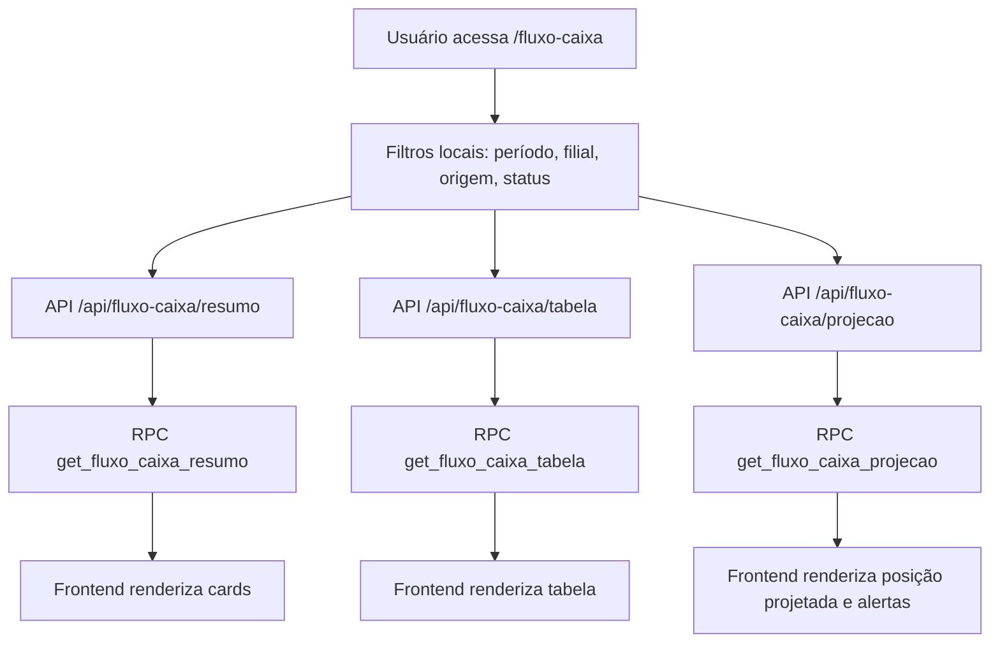

# Fluxo de Caixa - Fluxo de Integração

## Fluxo alvo

## Fontes candidatas

- `contas_receber`
- `contas_pagar`
- `faturamento`
- `entradas`
- `resumo_vendas_caixa`
- `branches`
- saldo inicial por filial/período

## Estratégia recomendada

### Etapa 1: confirmação estrutural

Extrair e validar:

- `create table` das tabelas financeiras
- `create function` de RPCs relacionadas
- campos de status, baixa, vencimento e liquidação

Status atual da etapa:

- `contas_receber`, `contas_pagar`, `entradas`, `faturamento` e `resumo_vendas_caixa` já foram confirmadas no schema `okilao`
- ainda não foi identificada uma estrutura explícita de saldo/tesouraria/ajuste

### Etapa 2: camada SQL

Criar uma visão consolidada ou família de RPCs:

- `get_fluxo_caixa_resumo`
- `get_fluxo_caixa_tabela`
- `get_fluxo_caixa_projecao`

Recomendação de composição:

- entradas realizadas: `contas_receber` com `data_recebimento`
- entradas previstas: `contas_receber` com `data_vencimento` e saldo aberto
- saídas realizadas: `contas_pagar` com `data_pagamento`
- saídas previstas: `contas_pagar` com `data_vencimento` e saldo aberto
- apoio operacional PDV: `resumo_vendas_caixa`
- apoio operacional comercial: agregações de `faturamento`
- apoio de compras/documentos: agregações de `entradas`

### Etapa 3: camada Next.js

Criar:

- `src/app/api/fluxo-caixa/resumo/route.ts`
- `src/app/api/fluxo-caixa/tabela/route.ts`
- `src/app/api/fluxo-caixa/projecao/route.ts`

### Etapa 4: frontend real

- trocar `mock-data.ts` por `useSWR`
- ligar estados de loading/erro
- adicionar drilldown por período e origem
